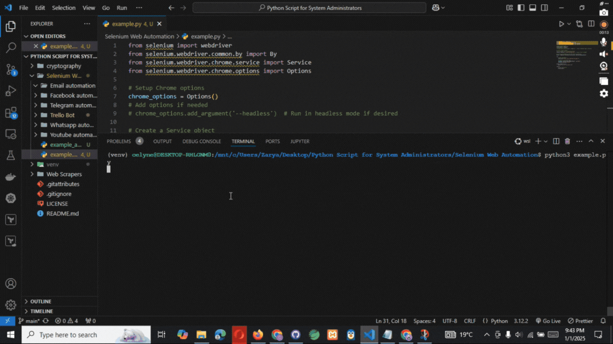
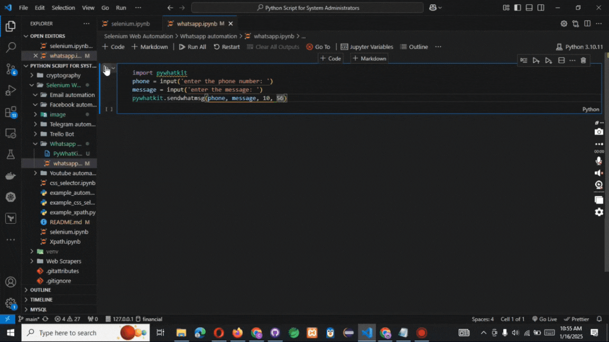

# Selenium Web Automation Scripts


A comprehensive and modular collection of Python automation scripts using Selenium WebDriver to simplify and automate tasks across various web platforms and applications.






## 📁 Project Structure

This repository is divided into the following directories and files for streamlined functionality and clarity:
Directories and Submodules

    Email Automation
    Automates email-related tasks like sending emails, reading inboxes, and managing filters.

    Facebook Automation
    Scripts for automating Facebook actions such as logging in, posting updates, and interacting with content.

    Telegram Bot
    Contains bot automation scripts for messaging and managing Telegram channels or groups.

    Trello Bot
    Handles Trello board tasks such as creating cards, assigning team members, and managing board lists.

    WhatsApp Automation
    Automates WhatsApp messaging, including sending bulk messages and managing chat responses.

    YouTube Automation
    Facilitates YouTube interactions like searching for videos, commenting, and managing playlists.

## Key Files

### Locator Strategy Examples

    Xpath.ipynb: A Jupyter notebook with practical examples and visual demonstrations of XPath in Selenium.

    css_selector.ipynb: Notebook showcasing the use of CSS selectors for efficient element location.

    example_xpath.py: Python examples demonstrating XPath usage in scripts.

    example_css_selector.py: Sample Python code illustrating CSS selector implementation.

    example_automation.py: A general automation script template to kickstart your custom tasks.

## 🛠️ Core Components

### Web Automation Features

    Email Management: Automate tasks like composing, sending, and organizing emails.

    Social Media Bots: Scripts for interactions on platforms such as Facebook and WhatsApp.

    Task Management Automation: Automate workflows in Trello and Telegram.

    Video Platform Automation: Scripts for interacting with YouTube’s search, comments, and playlists.

    Robust Selector Strategies: Leverage advanced XPath and CSS selectors for pinpoint accuracy.

## 🚀 Getting Started

### Prerequisites

Ensure your system has the following installed:

    Python 3.6+: Download Python
    Google Chrome Browser: Download Chrome
    WebDriver Manager: Simplifies ChromeDriver installation and updates.

Install required Python packages:

```Python
pip install selenium
pip install webdriver_manager
```

Setting Up the WebDriver

```python
from selenium import webdriver
from selenium.webdriver.chrome.service import Service
from selenium.webdriver.chrome.options import Options
from webdriver_manager.chrome import ChromeDriverManager

# Configure Chrome options and driver setup

chrome_options = Options()
chrome_options.add_argument("--start-maximized") # Open browser in fullscreen
driver = webdriver.Chrome(service=Service(ChromeDriverManager().install()), options=chrome_options)
```

### 💡 Usage Examples

#### XPath Example

Locate elements using advanced XPath strategies:

# Example: Locate a button by its class

```python
element = driver.find_element("xpath", "//button[contains(@class, 'submit-button')]")
element.click()
```

### CSS Selector Example

Interact with elements using CSS selectors:

# Example: Input email into a login form

```python
email_field = driver.find_element("css selector", "#login-form input[type='email']")
email_field.send_keys("test@example.com")
```

### Navigation and Automation

Automate web navigation and actions:

```python
# Navigate to a URL and interact with elements

driver.get("https://example.com")
login_button = driver.find_element("css selector", ".login-button")
login_button.click()
```

## 📋 To-Do List

Add error handling examples for dynamic content.  
Integrate platform-specific examples (e.g., LinkedIn, Instagram).  
Document best practices for Selenium scripts.  
Enhance setup instructions for MacOS/Linux environments.  
Add multi-browser support (e.g., Firefox, Edge).

## 🤝 Contributing

I welcome contributions from the community! To contribute:

```python
Fork the Repository: Click the "Fork" button at the top-right.
Clone Your Fork Locally:

git clone https://github.com/your-username/Python-Scripts.git
cd Python-Scripts/Selenium\ Web\ Automation

Create a New Branch:

git checkout -b feature/YourFeatureName

Commit and Push Changes:

    git add .
    git commit -m "Add feature: YourFeatureName"
    git push origin feature/YourFeatureName

    Submit a Pull Request: Navigate to the original repository and open a PR.
```

## 📝 License

This project is licensed under the MIT License. See the LICENSE file for details.
📧 Contact

    GitHub Profile: @mimi-netizen
    Email: celynekydd@gmail.com

## 🌟 Acknowledgments

Selenium Documentation: selenium.dev  
WebDriver Manager: Simplifying driver installation for multiple browsers.  
Python Community: For providing excellent resources and support.
