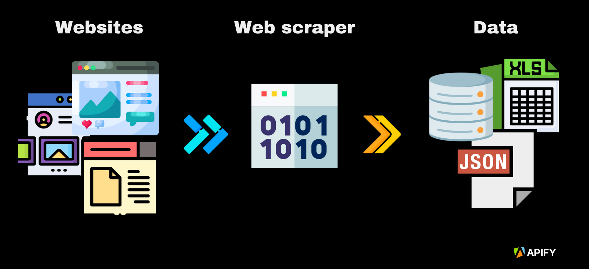

# Web Scrapers



A collection of Python web scraping scripts for automating data extraction from various websites.

## Table of Contents

- [Project Overview](#project-overview)
- [Features](#features)
- [Requirements](#requirements)
- [Installation](#installation)
- [Usage](#usage)
- [Scripts Description](#scripts-description)

## Project Overview

This repository contains various Python web scraping scripts designed to extract data from different websites. The scripts demonstrate different scraping techniques and can be used for tasks like monitoring web content, collecting data for analysis, or automating data extraction.

## Features

- Books Scraper: Extract book information from book websites
- Carrefour Website Scraper: Scrape product data from Carrefour
- HTML Scraper: General-purpose HTML data extraction
- IMDB Scraper: Collect movie and TV show information
- Indeed Job Scraper: Extract job listings from Indeed
- Python API Scraper: Interact with web APIs to collect data

## Requirements

- Python 3.x
- requests library
- BeautifulSoup4 library

Install required libraries:

```bash
pip install requests beautifulsoup4
```

## Installation

1. Clone the repository:

```bash
git clone https://github.com/mimi-netizen/Python-Scripts.git
```

2. Navigate to the Web Scrapers directory:

```bash
cd Python-Scripts/Web\ Scrapers
```

## Usage

To use any of the scripts:

1. Navigate to the specific scraper directory
2. Run the script using Python:

```bash
python <script_name>.py
```

## Scripts Description

### Books Scraper

- Purpose: Extract book information from book websites
- Features: Title, author, price, and description extraction

### Carrefour Website Scraper

- Purpose: Scrape product information from Carrefour
- Features: Product details, prices, and availability

### HTML Scraper

- Purpose: General-purpose HTML data extraction from remoteok website
- Features: Customizable HTML element targeting

### IMDB Scraper

- Purpose: Collect movie and TV show information
- Features: Ratings, cast information, and plot summaries

### Indeed Job Scraper

- Purpose: Extract job listings from Indeed
- Features: Job titles, companies, locations, and descriptions

### Python API Scraper

- Purpose: Interact with web APIs
- Features: API authentication and data retrieval
